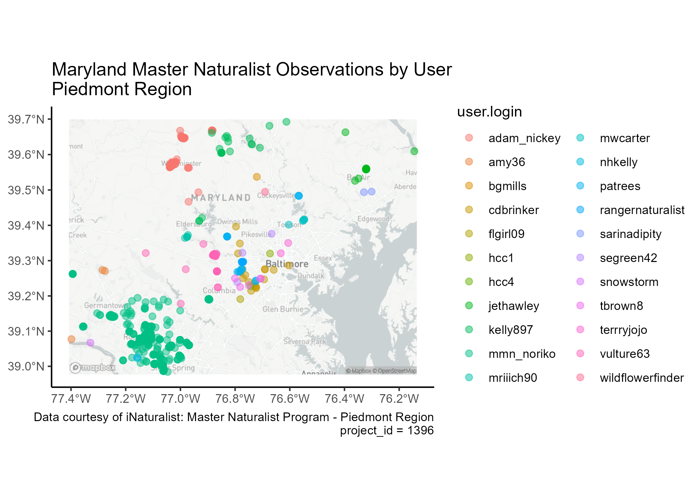

```{r, include = FALSE}
knitr::opts_chunk$set(
  collapse = TRUE,
  fig.path = "man/figures/README-",
  comment = "#>"
)
```

# Explore iNaturalist

## Introduction

This repository houses my final project for GES 600: Building Spatial Datasets. Explore iNaturalist is an exercise in using RStudio to explore open-source spatial datasets.

The goal of exploreinaturalist is to provide an introductory exploratory analysis of iNaturalist data.

<!-- badges: start -->

<!-- badges: end -->

## Background

### iNaturalist

[iNaturalist](https://www.inaturalist.org/) is an online social platform used to report and identify biological observations for the purpose of creating high quality biodiversity data. Use of iNaturalist is completely free, however you must sign up for an account.

Users can report observations via the iNaturalist app or by filling out the [observation form](https://www.inaturalist.org/observations/upload) on the website. Users have a multitude of options for details to include when submitting observations, including physical description, geolocation, and photos. iNaturalist uses reported or estimated geolocation to plot observation maps.


Users can report their findings independently or within a group project, or [bioblitz](https://www.inaturalist.org/pages/bioblitz+guide). The goal of these projects is to produce biodiversity surveys, which may be location specific or temporally-restricted. When a curator creates a project they choose a set of requirements for reported observations, in order to create a scientific standard for data collection.


### GBIF

The Global Biodiversity Information Facility (GBIF) is an internationally funded network and data infrastructure of biodiversity data. GBIF has a similar mission to iNaturalist, providing users to access to data from participating organizations -- iNaturalist is one of these organizations. GBIF has its own set of data standards, so there are discrepencies between iNaturalist data retrieved from GBIF versus iNaturalist directly.

## Working with iNat Data

### Accessing Data

iNaturalist data can be accessed using the iNat or GBIF APIs. Observations can be directly downloaded from the websites after using specified parameters to filter the data, or choosing a specific project. Data can also be accessed using rPackages [rinat](https://github.com/ropensci/rinat) and [rgbif](https://github.com/ropensci/rgbif).

I chose to look at observations specifically in Maryland and explored what projects were out there via the iNaturalist website. Therefore, I used `get_inat_obs_project()` to pull in data, since I already knew what project data I wanted. `rinat` also has functions to perform observation searches in R.

`rgbif` provides a slew of functions to search for occurrences, to retrieve data from GBIF. However, the occurrence search on the GBIF website is beautifully streamlined and I found it more intuitive than searching for data through R. In addition, the GBIF API has a 10,000 occurrence download limitation, so if working with large datasets you can submit a download request. Once the [download request](https://www.gbif.org/occurrence/download/request) is accepted you'll receive an email with a zip file for your data.

```{r access_data, eval = FALSE}
rinat::get_inat_obs_project("maryland-master-naturalist-program-piedmont-region", type = "observations")
#or
rgbif::occ_search(
    taxonKey = NULL,
    scientificName = NULL,
    country = "US",
    datasetKey = "50c9509d-22c7-4a22-a47d-8c48425ef4a7",
    hasCoordinate = TRUE,
    hasGeospatialIssue = FALSE,
    occurrenceStatus = "present",
    stateProvince = "Maryland"
  )
```

### Transforming Data

iNaturalist data comes in with 75 variables and will need to be honed down to the variables you want to work with. In comparison, GBIF data comes in with 88 variables. Again, these variables are not consistent between iNat and GBIF, so consider tidying column names before analyzing data.

Also note, geolocations are reported in lat/lon decimal format in corresponding variables.

### Data Analysis and Visualizations

You can visualize where each user reported observations within a project:



You can visualize the spatial boundaries of projects:


You can look at the breakdown of observations per biological kingdom:


You filter down observations by taxa and look at observation spatial distributions:


