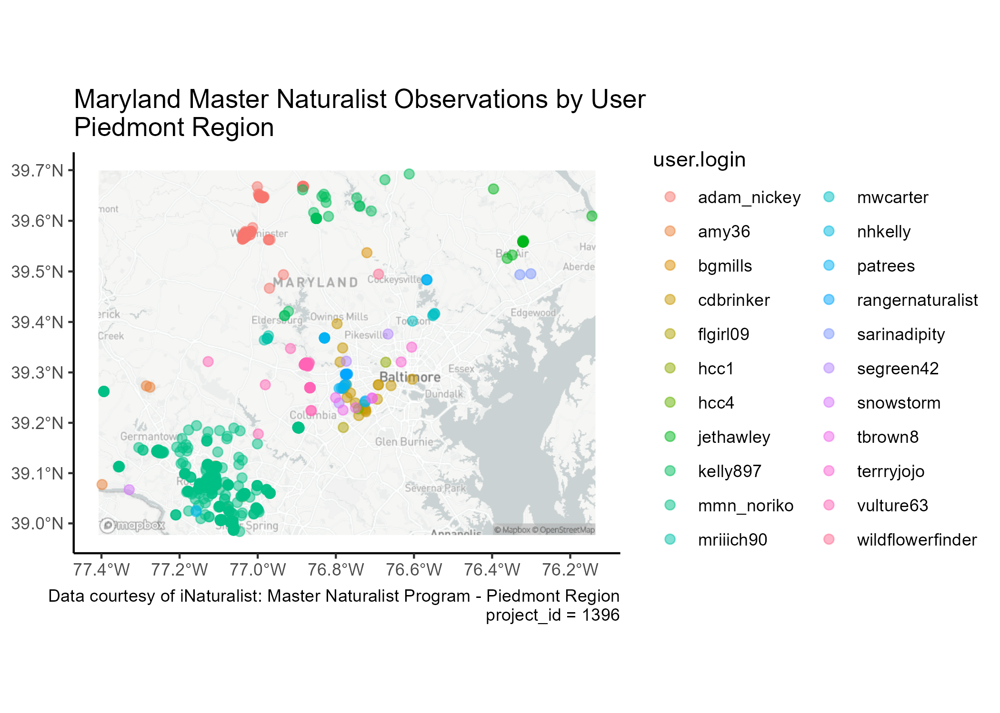
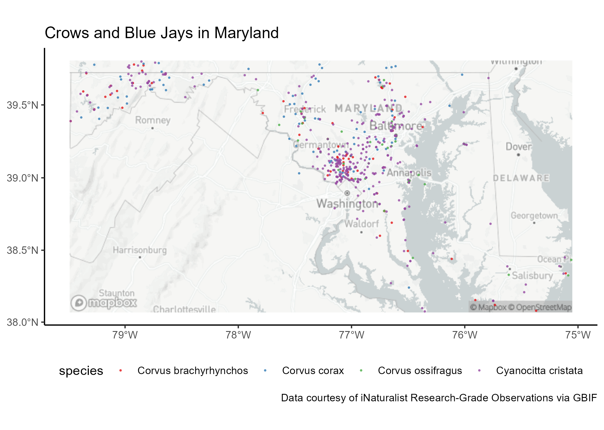

# Explore iNaturalist

## Introduction

This repository houses my final project for GES 600: Building Spatial
Datasets. Explore iNaturalist is an exercise in using RStudio to explore
open-source spatial datasets.

The goal of exploreinaturalist is to provide an introductory exploratory
analysis of iNaturalist data.

## Background

### iNaturalist

[iNaturalist](https://www.inaturalist.org/) is an online social platform
used to report and identify biological observations for the purpose of
creating high quality biodiversity data. Use of iNaturalist is
completely free, however you must sign up for an account.

Users can report observations via the iNaturalist app or by filling out
the [observation form](https://www.inaturalist.org/observations/upload)
on the website. Users have a multitude of options for details to include
when submitting observations, including physical description,
geolocation, and photos. iNaturalist uses reported or estimated
geolocation to plot observation maps.


Users can report their findings independently or within a group project,
or [bioblitz](https://www.inaturalist.org/pages/bioblitz+guide). The
goal of these projects is to produce biodiversity surveys, which may be
location specific or temporally-restricted. When a curator creates a
project they choose a set of requirements for reported observations, in
order to create a scientific standard for data collection.


### GBIF

The Global Biodiversity Information Facility (GBIF) is an
internationally funded network and data infrastructure of biodiversity
data. GBIF has a similar mission to iNaturalist, providing users to
access to data from participating organizations – iNaturalist is one of
these organizations. GBIF has its own set of data standards, so there
are discrepencies between iNaturalist data retrieved from GBIF versus
iNaturalist directly.

## Working with iNat Data

### Accessing Data

iNaturalist data can be accessed using the iNat or GBIF APIs.
Observations can be directly downloaded from the websites after using
specified parameters to filter the data, or choosing a specific project.
Data can also be accessed using rPackages
[rinat](https://github.com/ropensci/rinat) and
[rgbif](https://github.com/ropensci/rgbif).

I chose to look at observations specifically in Maryland and explored
what projects were out there via the iNaturalist website. Therefore, I
used `get_inat_obs_project()` to pull in data, since I already knew what
project data I wanted. `rinat` also has functions to perform observation
searches in R.

`rgbif` provides a slew of functions to search for occurrences, to
retrieve data from GBIF. However, the occurrence search on the GBIF
website is beautifully streamlined and I found it more intuitive than
searching for data through R. In addition, the GBIF API has a 10,000
occurrence download limitation, so if working with large datasets you
can submit a download request. Once the [download
request](https://www.gbif.org/occurrence/download/request) is accepted
you’ll receive an email with a zip file for your data.

``` r
rinat::get_inat_obs_project("maryland-master-naturalist-program-piedmont-region", type = "observations")
#or
rgbif::occ_search(
    taxonKey = NULL,
    scientificName = NULL,
    country = "US",
    datasetKey = "50c9509d-22c7-4a22-a47d-8c48425ef4a7",
    hasCoordinate = TRUE,
    hasGeospatialIssue = FALSE,
    occurrenceStatus = "present",
    stateProvince = "Maryland"
  )
```

### Transforming Data

iNaturalist data comes in with 75 variables and will need to be honed
down to the variables you want to work with. In comparison, GBIF data
comes in with 88 variables. Again, these variables are not consistent
between iNat and GBIF, so consider tidying column names before analyzing
data.

Also note, geolocations are reported in lat/lon decimal format in
corresponding variables.

### Data Analysis and Visualizations

You can visualize where each user reported observations within a
project:



You can visualize the spatial boundaries of projects:


You can look at the breakdown of observations per biological kingdom:


You can filter down observations by taxa and look at observation spatial
distributions:



## Next Tasks

Beyond exploring iNaturalist project data attributes, how can this
publicly-sourced biodiversity data be used?

Does this data hold value as evidence for making informed conservation
action plans and policy decisions?

In order to assess the value of iNaturalist data, I propose doing a
comparative analysis between iNaturalist data and other standardized
biodiversity survey data, with standards that were developed
specifically to inform decision-making. Some examples specifically for
Maryland include: [Maryland iMap](https://imap.maryland.gov/) and
[Maryland Open Data](https://opendata.maryland.gov/).

Things to compare would be:

- locations of observations (spatial patterns)

- level of confidence in identification

- photo or other media evidence associated with observation
